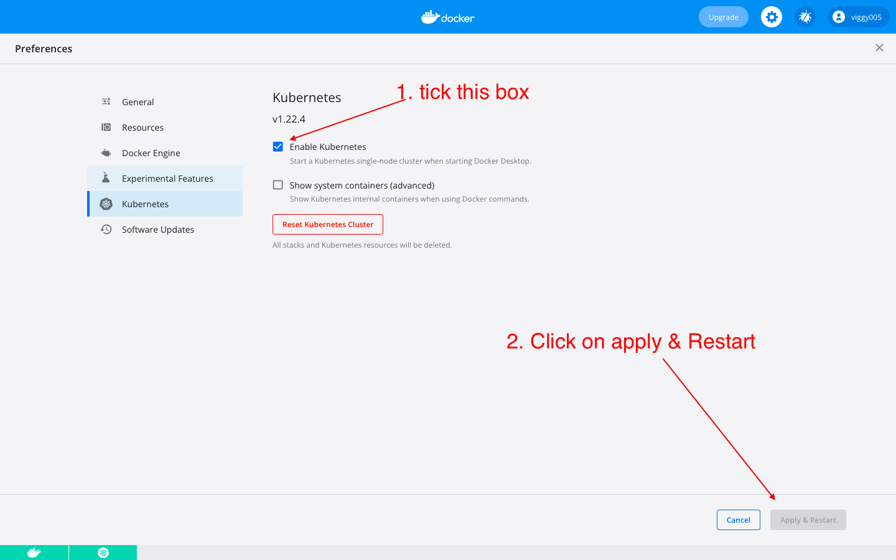
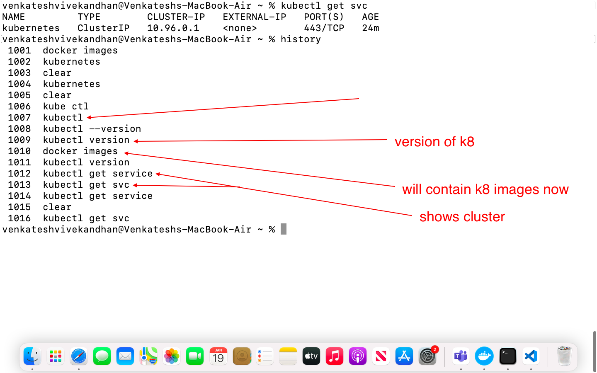
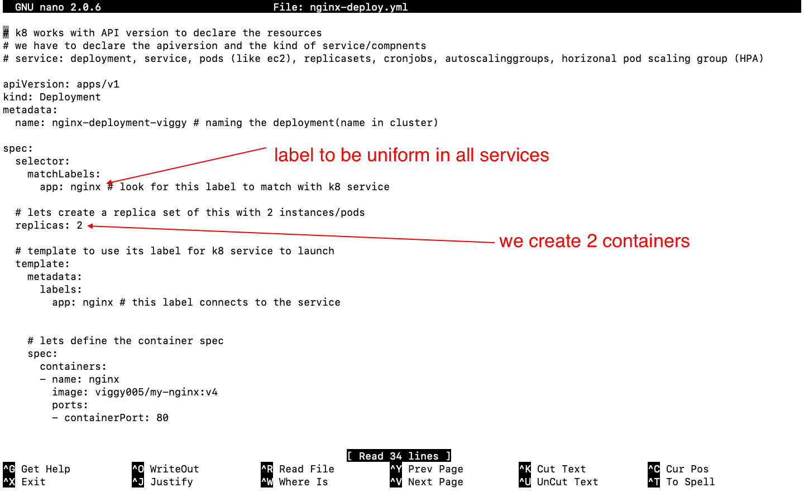
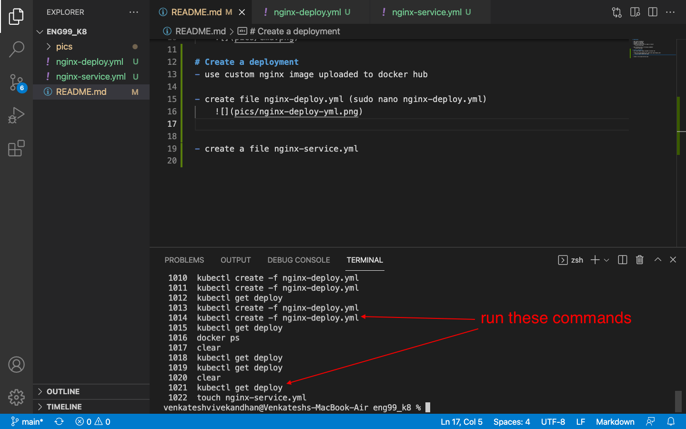
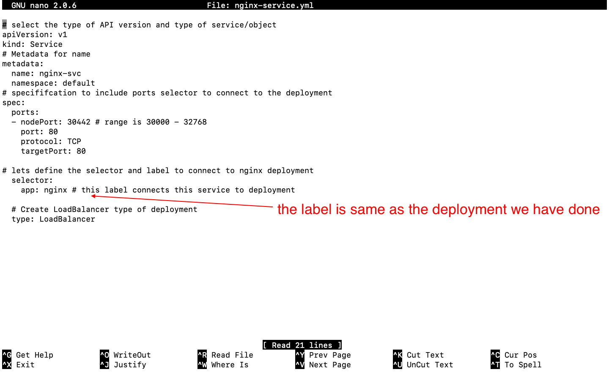

# kubernetes

- open docker dashboard
- naviagte to settings
- navigate to kubernetes
- check the box and click on apply & restart
    

- opne terminal and run following commands:
    

# Create a deployment
- use custom nginx image uploaded to docker hub

- create file nginx-deploy.yml (sudo nano nginx-deploy.yml)
    
- Run the file
    

- when we try "localhost" on bwoser we cannot see anything
- so we go ahead to create a load balancer service

# creata a LoadBalancer

- create a file nginx-service.yml
    

- run the file with command
-         kubectl create -f nginx-service.yml

# delete a pod and see new one spin up
-   kubectl get pods
-   kubectl delete pod nginx-deployment-viggy-6574d96dfd-ldqbq     (get the name from previous command)
- once deleted a new pod spins very quickly and also the loss of one pod does nto affect the users view of the webpage on localhost
